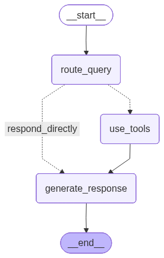

# Archon AI - Backend Application

This directory contains the FastAPI backend for Archon AI, an astrology chat application powered by LangGraph.

## Agent Architecture

The astrology agent uses **LangGraph's StateGraph** for stateful, orchestrated conversations with conditional routing and tool calling.



### Graph Flow

1. **`__start__`** - Entry point when user sends a message
2. **`route_query`** - Analyzes user query to determine routing:
   - Transit keywords ("today", "week", "now") → use tools
   - Synastry keywords ("compatible", "relationship") → use tools
   - General questions → respond directly
3. **`use_tools`** - Executes astrological tools:
   - `get_current_transits` - Current planetary aspects
   - `analyze_synastry` - Relationship compatibility
   - `search_chart_memory` - Natal chart search
4. **`generate_response`** - Creates personalized astrological response
5. **`__end__`** - Returns response to user

### Available Tools

| Tool | Purpose | Trigger Keywords |
|------|---------|------------------|
| `get_current_transits` | Calculate transit aspects for today/week | today, week, now, current, timing |
| `analyze_synastry` | Relationship compatibility analysis | compatible, relationship, partner |
| `search_chart_memory` | Search natal chart data | natal, placement, house |

## Directory Structure

```
app/
├── agents/           # LangGraph agent implementation
│   ├── graph_agent.py    # Main StateGraph agent
│   ├── tools.py          # Agent tools (transits, synastry)
│   └── prompts.py        # System prompts
├── api/              # FastAPI routes
│   └── routes/           # API endpoints
├── core/             # Configuration & utilities
│   ├── config.py         # Settings
│   └── logging_config.py # Logging setup
├── models/           # SQLAlchemy models
├── services/         # Business logic
│   ├── astrology/        # Kerykeion astrology service
│   └── llm/              # Multi-provider LLM service
└── agent_graph.png   # Auto-generated graph visualization
```

## LLM Configuration

The backend supports multiple LLM providers with automatic fallback:

| Provider | Model | Use Case |
|----------|-------|----------|
| **Groq** | llama-3.1-8b-instant | Primary (fast, cheap) |
| **Gemini** | gemini-2.0-flash | Fallback |
| **OpenAI** | gpt-4.1-nano | Alternative |

Configure via `.env`:
```env
LLM_PROVIDER=groq  # or openai, gemini
```

## Running the Backend

```bash
# Install dependencies
pip install -r requirements.txt

# Start server
uvicorn app.main:app --reload --host 0.0.0.0 --port 8000
```

## API Endpoints

- `GET /health` - Health check
- `POST /api/auth/register` - User registration
- `POST /api/auth/login` - JWT login
- `POST /api/user/chart` - Compute natal chart
- `WS /api/chat/ws` - WebSocket chat

## Testing

```bash
# CLI agent test tool
python cli_agent.py

# Tool calling test suite
python test_agent_tools.py
```
