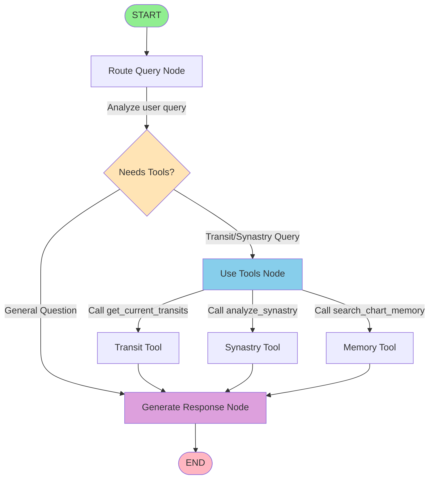

# Astrology LangGraph Agent Flow

This document describes the LangGraph agent architecture for the astrology chat application.

## Graph Overview

The agent uses **LangGraph's StateGraph** for stateful, orchestrated conversations with conditional routing, tool calling, and support for middleware (including human-in-the-loop).

## Mermaid Diagram



## Detailed Flow

### 1. **START → Route Query Node**
- Entry point when user sends a message
- State contains: messages, user_profile, natal_chart
- User's birth data and natal chart already loaded in context

### 2. **Route Query Node**
- **Purpose**: Analyze user's message to determine next action
- **Logic**:
  - Keywords: "transit", "today", "week" → needs transits
  - Keywords: "compatible", "relationship" → needs synastry
  - Keywords: "natal", "chart", "placement" → needs chart search
  - Otherwise → respond directly
- **Output**: Sets `next_action` in state

### 3. **Conditional Edge: should_use_tools()**
- **Decision Point**: Route based on `next_action`
- **Paths**:
  - `"use_tools"` → Go to Use Tools Node
  - `"respond_directly"` → Go to Generate Response Node

### 4. **Use Tools Node** (if tools needed)
- **Purpose**: Execute astrological calculations
- **Available Tools**:
  1. `get_current_transits(date)` - Calculate transit aspects
  2. `analyze_synastry(partner_data)` - Relationship compatibility
  3. `search_chart_memory(query)` - Search natal chart data
- **Process**:
  - LLM bound with tools decides which to call
  - Tools execute with user's natal chart context
  - Results stored in state
- **Output**: Tool results added to messages

### 5. **Generate Response Node**
- **Purpose**: Create personalized astrological response
- **Context Available**:
  - User's natal chart (always in system prompt)
  - Conversation history
  - Tool results (if any)
  - User profile data
- **Process**:
  - System prompt includes natal summary
  - LLM generates response with full context
  - Response added to messages
- **Output**: Final AI message

### 6. **END**
- Graph execution completes
- Final state returned with all messages

## State Schema

```python
class AstrologyAgentState(TypedDict):
    # Conversation
    messages: Annotated[Sequence[BaseMessage], add_messages]

    # User Context (permanent)
    user_id: str
    user_profile: dict  # Birth data, preferences
    natal_chart: dict   # Pre-computed chart

    # Routing
    next_action: str    # "use_tools" or "respond_directly"

    # Tool Results
    tool_outputs: list  # Results from tool calls

    # Metadata
    tokens_used: int
    cost_usd: float
```

## Key Features

### ✅ **Stateful Management**
- State flows through all nodes
- Automatic message history merging with `add_messages`
- User context persists throughout conversation

### ✅ **Conditional Routing**
- Intelligent routing based on query intent
- Avoids unnecessary tool calls
- Optimizes token usage

### ✅ **Tool Integration**
- LLM decides which tools to call
- Tools have access to user's natal chart
- Multiple tools can be called in sequence

### ✅ **Middleware Support** (Future Enhancement)
```python
# Example: Human-in-the-loop middleware
from langgraph.checkpoint import MemorySaver

# Add checkpointer for persistence
memory = MemorySaver()
graph = workflow.compile(checkpointer=memory)

# Can interrupt and resume
config = {"configurable": {"thread_id": "user-123"}}
result = graph.invoke(input_data, config=config)
```

### ✅ **Streaming**
- Supports streaming responses via `astream_events`
- Real-time output as graph executes
- Better UX for long responses

## Advantages Over Simple Chain

| Feature | LangGraph | Simple Chain |
|---------|-----------|--------------|
| **State Management** | ✅ Built-in | ❌ Manual |
| **Conditional Routing** | ✅ Native | ⚠️ Complex |
| **Persistence** | ✅ Checkpoints | ❌ None |
| **HITL** | ✅ Interrupts | ❌ Difficult |
| **Visualization** | ✅ Graph | ❌ No |
| **Debugging** | ✅ Easy | ⚠️ Harder |
| **Streaming** | ✅ Events | ⚠️ Limited |

## Future Enhancements

### 1. **Human-in-the-Loop (HITL)**
```python
# Add interrupt before tool calls
workflow.add_node("approve_tools", approval_node)
workflow.add_edge("route_query", "approve_tools")
workflow.add_conditional_edges("approve_tools", ...)
```

### 2. **Memory Storage Node**
```python
# Add node to store insights in Chroma DB
workflow.add_node("store_memory", store_memory_node)
workflow.add_edge("generate_response", "store_memory")
workflow.add_edge("store_memory", END)
```

### 3. **Middleware Layers**
```python
# Add custom middleware
from langgraph.middleware import Middleware

class LoggingMiddleware(Middleware):
    def on_node_start(self, node_name, state):
        logger.info(f"Entering node: {node_name}")

    def on_node_end(self, node_name, state):
        logger.info(f"Exiting node: {node_name}")

graph = workflow.compile(middleware=[LoggingMiddleware()])
```

### 4. **Multi-Agent Coordination**
```python
# Add specialized agents for complex queries
workflow.add_node("deep_analysis_agent", deep_agent)
workflow.add_conditional_edges("route_query", {
    "complex": "deep_analysis_agent",
    "simple": "generate_response"
})
```

## References

- [LangGraph Documentation](https://docs.langchain.com/oss/python/langgraph/)
- [Human-in-the-Loop Tutorial](https://medium.com/@kbdhunga/implementing-human-in-the-loop-with-langgraph-ccfde023385c)
- [LangGraph Examples](https://github.com/langchain-ai/langgraph)
- [StateGraph API](https://docs.langchain.com/oss/python/langgraph/graph-api)
- [Middleware Guide](https://www.clickittech.com/ai/langchain-1-0-vs-langgraph-1-0/)

## Graph Visualization

To visualize the actual compiled graph:

```python
from IPython.display import Image, display

# Compile graph
graph = agent.build_graph(user_profile, natal_chart)

# Generate visualization
try:
    display(Image(graph.get_graph().draw_mermaid_png()))
except Exception:
    print(graph.get_graph().draw_mermaid())
```
